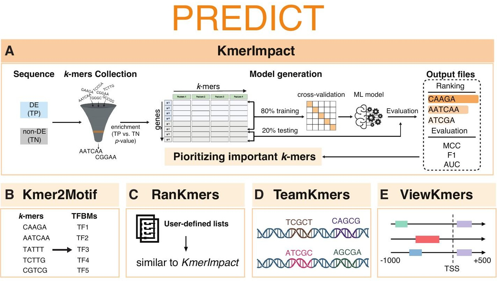

# PREDICT: A Modular and Versatile Python Tool for Streamlining Cis-Regulatory Element Discovery

## Introduction

Understanding how genes are transcriptionally regulated is a central goal in functional genomics, particularly in plants and non-model organisms where transcription factor binding data are often limited. Gene expression is controlled by short regulatory DNA sequences known as **cis-regulatory elements (CREs)**, which interact with transcription factors (TFs) to activate or repress transcription. Identifying these sequences and evaluating their combinatorial influence remains challenging due to the fragmented nature of current computational tools.

**PREDICT** is designed to address this gap.

PREDICT is a **modular and integrative platform** for discovering CREs, linking them to known transcription factor binding motifs (TFBMs), and evaluating their potential regulatory function. The pipeline streamlines sequence discovery, motif matching, combinatorial analysis, and visualization within a unified framework.

PREDICT supports a wide range of genome-scale datasets and offers robust interpretability, making it suitable for biological researchers across disciplines.

---

## What Does PREDICT Do?

PREDICT enables users to:

- **Identify enriched short sequences (k-mers)** associated with differentially expressed genes.
- **Match identified k-mers to known transcription factor motifs** from databases.
- **Quantify the predictive power** of each k-mer for distinguishing gene expression patterns.
- **Evaluate co-occurring k-mer patterns**, which may reflect cooperative regulatory mechanisms.
- **Visualize spatial distribution** of motifs across gene regulatory regions.

This workflow supports hypothesis generation for regulatory motif function and network inference.

---

## Key Modules (Functions)

PREDICT includes **five core modules**. Each module performs a distinct analytical function and can be run independently or as part of a complete pipeline.

### 1. KmerImpact – Identify Enriched Sequences and Evaluate Their Prediction Power

#### Scoring Formulas

- **AllCopies_FeatureImportance.txt**:
  - `Final_Rank`: Mean of k-mer rank across 5-fold cross-validation.
  - `Weighted_percentile`: Average percentile of feature importance weighted by fold.
  - `Weighted_Percentile_sd`: Standard deviation of weighted percentiles.
  - `Average_Score`: Mean feature importance score across folds.
  - `Score_sd`: Standard deviation of feature importance scores.
  - `Counts`: Number of folds where the k-mer was selected.

- **ALLCopies_mean_score.txt**:
  - `AUC`: Computed from ROC curve of model predictions.
  - `F1`: `F1 = (2 × Precision × Recall) / (Precision + Recall)`
  - `MCC`: `Matthews correlation coefficient = (TP × TN – FP × FN) / √((TP+FP)(TP+FN)(TN+FP)(TN+FN))`

- **Kmer_ShortTable.tsv**:
  - `Kmer_ID`: Encoded as `[strand]K[length][numeric representation of sequence]`
    - Example: `nt_K05_23223` → k-mer of length 5 on the non-template strand.

- **KmerXKmer_table.tsv**:
  - Each cell contains the co-occurrence count of two k-mers across gene regulatory regions.

- **TPGeneXKmer_Table.tsv / TNGeneXKmer_Table.tsv**:
  - Matrix of raw k-mer counts per gene used in machine learning model training.

- **Input**: DEG list, non-DEG list, reference genome (FASTA), and genome annotation (GFF3).
- **Function**: Scans defined regulatory regions (e.g., promoters) to identify k-mers enriched in DEGs.
- **Output**: List of candidate CREs ranked based on importance scores.

---

### 2. Kmer2Motif – Match Sequences to Known TF Motifs

- **Input**: K-mers from KmerImpact and user-provided motif database (FASTA format).
- **Function**: Matches k-mers to consensus motifs using similarity scoring algorithms.
- **Output**: Ranked motif-kmer mapping table with similarity scores.

---

### 3. RanKmers – Rank K-mers Based on Predictive Value

- **Input**: DEG/non-DEG lists, genome, annotation, and k-mer list.
- **Function**: Uses machine learning classifiers to evaluate how well each k-mer distinguishes DEGs from non-DEGs.
- **Output**: Feature importance rankings and model performance metrics (e.g., AUC, F1).

---

### 4. TeamKmers – Identify Co-occurring K-mer Modules

- **Input**: K-mer occurrence matrices for DEGs and non-DEGs.
- **Function**: Calculates co-occurrence scores and identifies motif pairs likely acting together.
- **Output**: Co-occurring k-mer and motif pairs, similarity matrices.

---

### 5. ViewKmers – Visualize Motif Distribution

- **Input**: Gene list, k-mer list, genome, annotation (optionally motifs).
- **Function**: Launches an interactive browser interface to visualize motif positions along gene regulatory regions.
- **Output**: Web-based interface displaying:
  - The distributions of motif sites for a given motif at a single-gene level.
  - The distances of motif sites for a pair of motifs.

> ⚠️ This module should be executed **locally using Streamlit**. It is **not designed for high-throughput cluster execution**.

---

## How to Install

### Step 1: Clone the Repository

```bash
git clone https://github.com/ChiaYiCheng-NTU/PREDICT.git
cd PREDICT/Install
```

### Step 2: Set Up the Environment

PREDICT uses Conda to configure its dependencies.

**Option A: Local Installation**

```bash
bash Install.sh
cd ../
```

**Option B: HPC Installation**

```bash
qsub -v CONDA_BASE=$(conda info --base) Install_PBS.sh
cd ../
```

> 🛠 Modify `Install_PBS.sh` to set the appropriate queue name for your HPC environment.

### Step 3: Run the Example

Download and extract toy data:

```bash
wget https://github.com/ChiaYiCheng-NTU/PREDICT/releases/download/v1.1.0/PREDICT_ToyData.tar.gz
tar -xzvf PREDICT_ToyData.tar.gz
```

Execute the example:

```bash
bash ExampleRUN.sh  # Or use qsub for HPC submission
```

---

## Troubleshooting and Support

Each module is documented and logs output files for inspection. For help:

- Examine files in the `Result/` directory.
- Review `ExampleRUN.sh` for an end-to-end demonstration.
- Submit questions or issues to the GitHub repository.

---

## Summary

PREDICT is a unified framework for cis-regulatory element discovery and analysis. It is especially well-suited for:

- Functional genomics in species with limited TF-binding datasets.
- Comparative regulatory motif studies.
- Integration of expression data with sequence-based predictions.

By connecting k-mer discovery, motif mapping, machine learning, and visualization, PREDICT facilitates a systems-level understanding of gene regulation.
